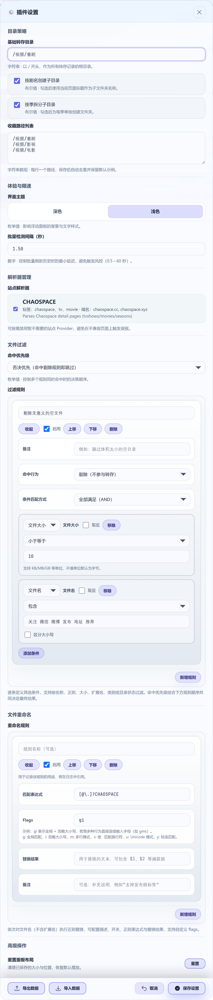

# Pan Transfer (转存助手)

[English](#english) | [中文](#中文)

---

<a name="english"></a>

## English

A browser extension designed to simplify the process of transferring files from specific web pages to your cloud storage.

### What It Does

This tool currently focuses on enhancing the experience on certain websites (like Chaospace). When you visit a supported page, it will:

- **Recognize Resources**: A floating panel appears on the page, listing the files available for transfer.
- **Batch Transfers**: You can select the files you need and save them to your Baidu Netdisk with a single click.
- **Keep It Simple**: It offers a clean interface, light/dark themes, and some straightforward settings, aiming to be as non-intrusive as possible.
- **Track Your History**: A local history of your transfers is kept for your reference.

### How to Use

1.  **Installation**:
    - Download the `pan-transfer-extension.zip` file from the [latest GitHub Release](https://github.com/muyuanjin/pan-transfer/releases).
    - Unzip the file to a local folder. **This folder will contain files like `manifest.json`.**
    - In Chrome/Edge, go to `chrome://extensions` or `edge://extensions`.
    - Enable "Developer mode", click "Load unpacked", and **select the folder where you just extracted the files**.
2.  **Usage**:
    - Make sure you are logged into both the source website (e.g., Chaospace) and Baidu Netdisk in your browser.
    - Navigate to a supported page, and the extension's panel will appear. Use it to select and transfer files.

### Screenshots

<p align="center">
  
</p>
<p align="center">
  
</p>
<p align="center">
  
</p>
<p align="center">
  
</p>

### For Developers

This is an open-source project built with Vue 3, TypeScript, and Manifest V3. If you're interested in contributing or just tinkering with the code, here are the basics:

- Install dependencies: `npm install`
- Start the development server: `npm run dev`
- Run tests and checks: `npm run check`

For more detailed information on adding new site/storage providers or understanding the architecture, please refer to the documentation within the `docs/` directory and the source code.

#### Refreshing Screenshots

To regenerate the README screenshots with the latest UI:

1.  Build the extension bundle (required for the Playwright harness):
    ```bash
    npm run build
    ```
2.  Capture the screenshots via the automated Playwright script:
    ```bash
    npm run capture:screenshots
    ```
    The script launches Chromium with the built extension, drives representative UI flows, and rewrites the PNG assets under `docs/`.

### Disclaimer

- This project is developed for learning and convenience. It is not officially affiliated with any of the websites or cloud services it supports.
- Please use this tool responsibly and in accordance with the terms of service of the respective websites.

<br>
<br>
<br>

---

<a name="中文"></a>

## 中文

一个浏览器扩展，旨在简化从特定网页将文件转存到网盘的过程。

### 功能简介

这个工具目前专注于优化部分网站（如 Chaospace）的浏览体验。当您访问支持的页面时，它会：

- **自动识别资源**：在页面上显示一个悬浮面板，列出可供转存的文件。
- **批量选择与转存**：您可以勾选需要的文件，一键将它们保存到您的百度网盘。
- **保持简洁**：提供清爽的界面、明亮/暗色主题，以及一些简单的设置项，尽量不打扰您的正常浏览。
- **查看转存历史**：在本地保留您的转存记录，方便回顾。

### 使用方法

1.  **安装扩展**：
    - 从 [GitHub Releases 页面](https://github.com/muyuanjin/pan-transfer/releases)下载最新的 `pan-transfer-extension.zip` 文件。
    - 将下载的压缩包解压到一个本地文件夹。**这个文件夹里会包含 `manifest.json` 等文件。**
    - 在 Chrome/Edge 浏览器中访问 `chrome://extensions` 或 `edge://extensions`。
    - 打开右上角的“开发者模式”，然后点击“加载已解压的扩展程序”，**选择您刚刚解压文件后得到的那个文件夹**。
2.  **开始使用**：
    - 请确保您的浏览器已经登录了目标网站（如 Chaospace）和百度网盘的账号。
    - 访问支持的页面，扩展面板便会自动出现，之后按提示操作即可。

### 功能截图

<p align="center">
  
</p>
<p align="center">
  
</p>
<p align="center">
  
</p>
<p align="center">
    
</p>

### 开发者指南

这是一个使用 Vue 3、TypeScript 和 Manifest V3 构建的开源项目。如果您有兴趣参与贡献或修改代码，可以参考以下基本命令：

- 安装依赖：`npm install`
- 启动开发环境：`npm run dev`
- 运行检查与测试：`npm run check`

关于如何扩展新的站点或存储支持、以及项目的详细架构，请参考 `docs/` 目录下的文档和代码注释。

#### 更新功能截图

如需使用最新的 UI 重新生成 README 中的截图：

1.  构建扩展程序包（Playwright 测试工具需要）：
    ```bash
    npm run build
    ```
2.  通过 Playwright 自动化脚本捕捉截图：
    ```bash
    npm run capture:screenshots
    ```
    该脚本会启动一个加载了此扩展的 Chromium 浏览器，模拟代表性的 UI 操作流程，并覆盖 `docs/` 目录下的 PNG 图片资源。

### 免责声明

- 本项目是一个出于学习和便利目的的个人项目，与所支持的任何网站或云服务商均无官方关联。
- 请在遵守相关网站服务条款的前提下，合理使用本工具。
