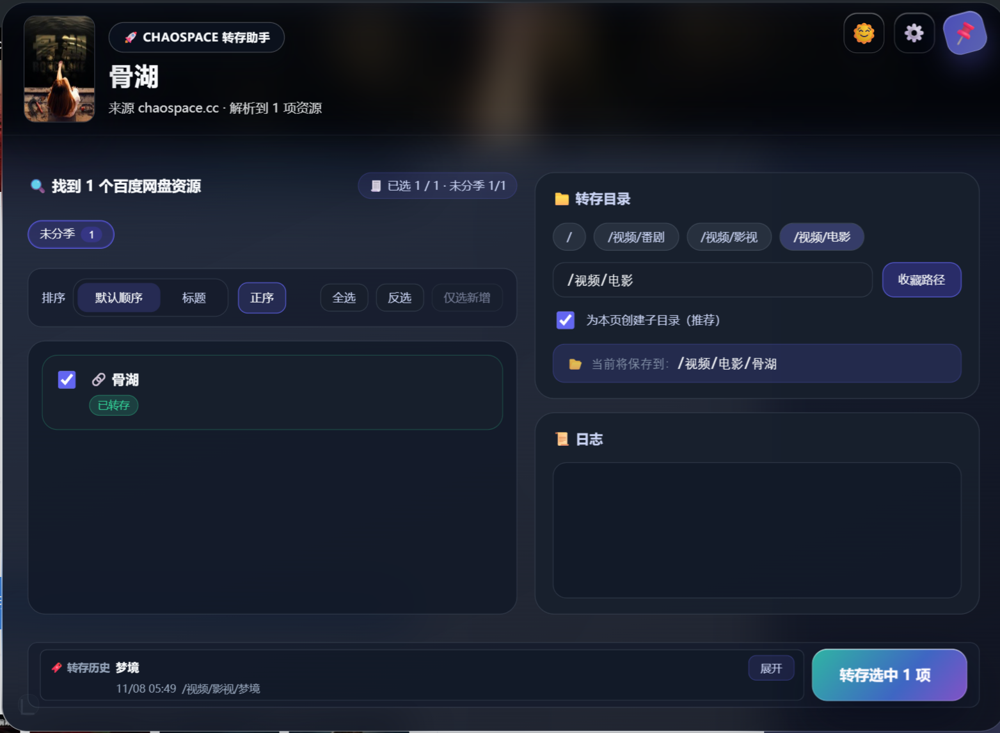
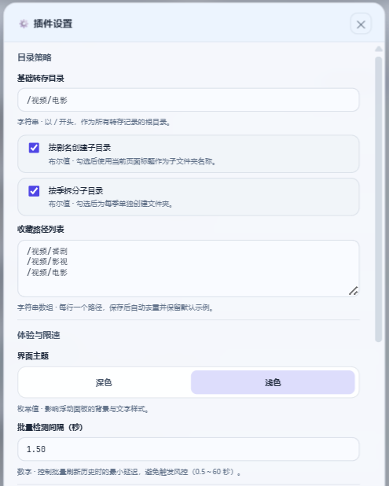
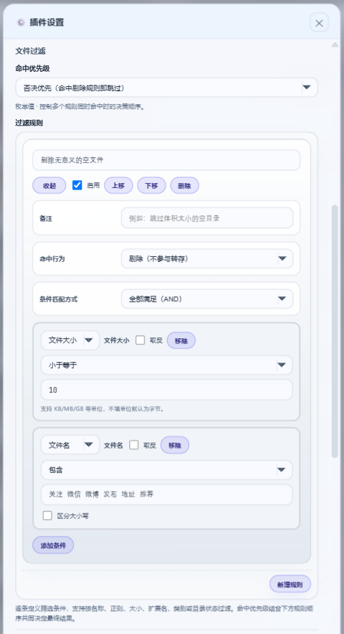
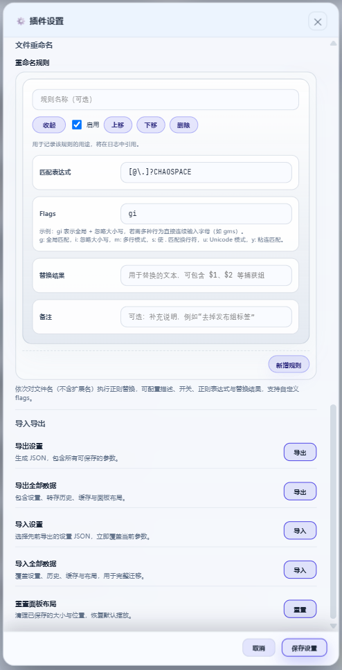

# Pan Transfer Chrome Extension / Pan Transfer 转存助手

[English](#english) | [中文](#中文)

<a name="english"></a>

## English Version

### Purpose

Pan Transfer is a Manifest V3 Chrome/Edge extension built with Vite 7, TypeScript 5.9, and Vue 3. The current build is dedicated to Chaospace (chaospace.xyz / chaospace.cc) pages and helps copy the public resource metadata from those pages into a user's personal Baidu Netdisk workspace. The project is open-source, intended for research/testing, and carries no commercial promises.

### Current Capabilities

- Detect Chaospace detail pages and render a floating Vue panel with the matched titles, seasons, and downloadable assets.
- Allow users to select files, adjust renaming presets, and push the choices to Baidu Netdisk while keeping a local history of transfers.
- Provide non-intrusive toasts, toolbar actions, and panel preferences so the overlay can stay pinned or hidden per tab.
- Offer both light and dark layouts plus granular settings for filters and path presets.

### Screenshots

<p align="center">
  
</p>
<p align="center">
  
</p>
<p align="center">
  
</p>
<p align="center">
  
</p>
<p align="center">
  
</p>
<p align="center">
  
</p>
<p align="center">
  
</p>

### Installation (Chrome/Edge)

1. Download `pan-transfer-extension.zip` from the latest GitHub Release or the `Release` workflow run artifacts.
2. Verify that the archive only contains the generated `dist/` assets, then unzip it to a convenient folder.
3. Open `chrome://extensions/` (or `edge://extensions/`), enable **Developer mode**, select **Load unpacked**, and choose the extracted `dist/` directory.
4. Sign in to Chaospace and Baidu Netdisk in your browser profile before using the panel.

### Development Workflow

1. Install dependencies once: `npm install`.
2. Start a hot-reload preview: `npm run dev`.
3. Build the MV3 bundle: `npm run build`.
4. Run lint + type + test gate: `npm run check` (runs `format:silent → typecheck → lint:ci → build → test → e2e`).

Key standalone scripts:

- `npm run typecheck` – `vue-tsc --noEmit -p tsconfig.app.json`.
- `npm run test` – Vitest suites covering parsers, renderers, and history logic.
- `npm run e2e` – Builds (if needed) then launches Playwright tests against Chaospace fixtures.
- `npm run lint` / `npm run lint:ci` – ESLint with/without the zero-warning gate.
- `node scripts/generate-icons.mjs` – re-generates the extension icons (`src/public/icon-48.png`, `src/public/icon-128.png`) using the canvas-based artwork.

### Repository Layout (excerpt)

```
pan-transfer/
├── src/
│   ├── background/        # Service worker, Baidu integrations, message routing
│   ├── content/           # Panel UI, controllers, history overlays, styles
│   ├── shared/            # Types, logging helpers, utilities
│   └── manifest.json      # MV3 definition
├── docs/                  # Screenshots and internal notes
├── tests/e2e/             # Playwright test
├── scripts/               # Helper scripts (e.g., e2e runner)
├── .github/workflows/     # Release automation (see release.yml)
└── README.md
```

### Release Automation

The `.github/workflows/release.yml` workflow can be triggered manually (`workflow_dispatch`) or by pushing a tag such as `v1.0.0`. It performs `npm ci`, runs `npm run check`, builds the extension, zips the `dist/` output, and uploads `pan-transfer-extension.zip` both as a workflow artifact and as a GitHub Release asset (for tagged runs). Review the workflow logs before distributing any build.

### Notes

- Logs are routed through `chaosLogger` and always include the `[Pan Transfer]` prefix for easier debugging.
- The project is unaffiliated with Chaospace or Baidu. Use it responsibly and follow the terms of the target services.
- Do not store personal credentials in the repository; rely on your browser profile for authentication.

---

<a name="中文"></a>

## 中文版本

### 项目说明

Pan Transfer 是一个基于 Vite 7、TypeScript 5.9 与 Vue 3 的 Manifest V3 Chrome/Edge 扩展，当前版本仅针对 Chaospace (chaospace.xyz / chaospace.cc) 页面，帮助用户把公开的资源信息整理并转存到自己的百度网盘目录。本项目开源共享，用于个人研究或自测，不包含任何商业承诺。

### 现有功能

- 识别 Chaospace 影片/剧集详情页，在页面上方渲染浮动面板并列出匹配的剧集、季和资源。
- 支持选择文件、调整重命名预设，并把选择结果提交给百度网盘，同时保留本地转存历史。
- 通过提示气泡、工具栏按钮和面板偏好设置，在不同标签页中维持独立的显示状态。
- 提供明亮/暗色主题和更细致的过滤、路径预设配置项。

### 安装步骤（Chrome/Edge）

1. 前往 GitHub Releases 或最新一次 `Release` 工作流运行记录，下载 `pan-transfer-extension.zip`。
2. 确认压缩包仅包含构建生成的 `dist/` 内容，并将其解压到本地目录。
3. 打开 `chrome://extensions/` 或 `edge://extensions/`，开启“开发者模式”，点击“加载已解压的扩展程序”，选择刚解压的 `dist/` 目录。
4. 使用前请确保浏览器已登录 Chaospace 与百度网盘账号。

### 开发与测试

1. `npm install` 安装依赖。
2. `npm run dev` 启动带热更新的开发预览。
3. `npm run build` 构建生产包。
4. `npm run check` 运行完整质量闸门（`format:silent → typecheck → lint:ci → build → test → e2e`）。

常用脚本：

- `npm run typecheck`：`vue-tsc --noEmit -p tsconfig.app.json`。
- `npm run test`：运行 Vitest 单元测试。
- `npm run e2e`：若缺少 `dist/manifest.json` 则会先构建，再执行 Playwright 测试。
- `npm run lint` / `npm run lint:ci`：ESLint（后者警告即失败）。
- `node scripts/generate-icons.mjs`：通过画布脚本重新生成 `src/public/icon-48.png` 与 `src/public/icon-128.png`。

### 仓库结构（节选）

```
pan-transfer/
├── src/background/      # Service worker 及百度网盘 API 交互
├── src/content/         # Vue 面板、控制器、历史与样式
├── src/shared/          # 类型、日志、工具函数
├── docs/                # 截图与内部文档
├── tests/e2e/           # Playwright 测试
├── scripts/             # 辅助脚本
├── .github/workflows/   # GitHub Action（release.yml）
└── README.md
```

### 发布与注意事项

- 日志统一带有 `[Pan Transfer]` 前缀，便于排查。
- 项目与 Chaospace、百度无官方关联，请遵守目标站点/服务的使用条款。
